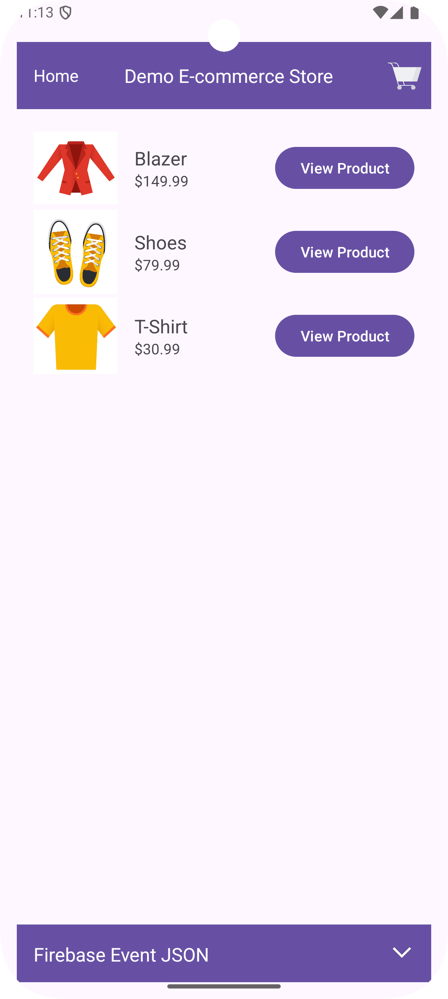
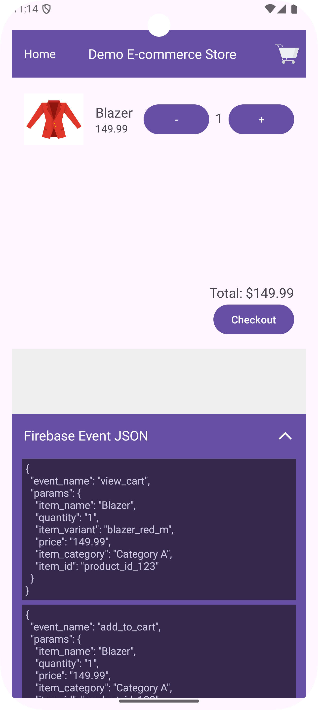

# E-commerce Demo App (Android)

This demo Android app showcases core e-commerce functionalities, integrated with Firebase for analytics and tracking,
event JSON preview, and Server-Side Google Tag Manager (SGTM) for Apps. It provides a foundation for building a
data-driven e-commerce experience.
<br> <br> <p align="center"></p>

## Table of Contents

* [Prerequisites](#prerequisites)
* [Installation](#installation)
* [Firebase Setup](#firebase-setup)
* [Running the App](#running-the-app)
* [Features](#features)
* [Event JSON Preview](#event-json-preview)
* [SGTM for Apps](#sgtm-for-apps)

## Prerequisites

* Android Studio Giraffe (2022.3.1) or higher
* Android SDK versions:
    * compileSdkVersion: 35
    * targetSdkVersion: 35
    * minSdkVersion: 24
* Firebase Account

## Installation

1. Clone the repository:

   ```bash
   git clone https://github.com/google-marketing-solutions/gtm-boilerplate.git
   ```

2. Open the project in Android Studio:

    * Start Android Studio.
    * Select "Open an Existing Project".
    * Navigate to the cloned repository directory and select the project.

## Firebase Setup

1. Create a Firebase project (if you don't already have one):

    * Go to the [Firebase console](https://console.firebase.google.com/).
    * Add a new project and follow the instructions.

2. Register your Android app with Firebase:

    * In your Firebase project, go to "Project settings" -> "Your apps".
    * Click "Add app" and select Android.
    * Provide the package name (e.g., com.gtm.boilerplate.android), a nickname (optional), and the debug signing
      certificate SHA-1 (required).
    * Download the `google-services.json` file and place it in the `app/` directory of your Android project.

3. No need to add Firebase SDKs manually as it is already present in your `build.gradle` files.

## Running the App

1. Build the app in Android Studio: Click the "Build" button (or use the Build menu).
2. Run the app on an emulator or a connected Android device.

## Features

* Product Browsing
* Add to Cart
* Checkout
* Firebase Analytics integration for tracking key user interactions.

## Event JSON Preview

This app includes a feature to preview the JSON payloads of events being sent to Firebase and SGTM. This is valuable for
debugging and validating your tracking implementation.
<br><br> <p align="center">    </p>

## SGTM for Apps

Server-Side Google Tag Manager for Apps is integrated to manage and deploy marketing tags and tracking configurations
server-side.  [Link to sGTM setup ReadMe].

## Disclaimers

**This is not an officially supported Google product.**

Copyright 2025 Google LLC. This solution, including any related sample code or data, is made available on an “as is,”
“as available,” and “with all faults” basis, solely for illustrative purposes, and without warranty or representation of
any kind. This solution is experimental, unsupported and provided solely for your convenience. Your use of it is subject
to your agreements with Google, as applicable, and may constitute a beta feature as defined under those agreements. To
the extent that you make any data available to Google in connection with your use of the solution, you represent and
warrant that you have all necessary and appropriate rights, consents and permissions to permit Google to use and process
that data. By using any portion of this solution, you acknowledge, assume and accept all risks, known and unknown,
associated with its usage, including with respect to your deployment of any portion of this solution in your systems, or
usage in connection with your business, if at all.
