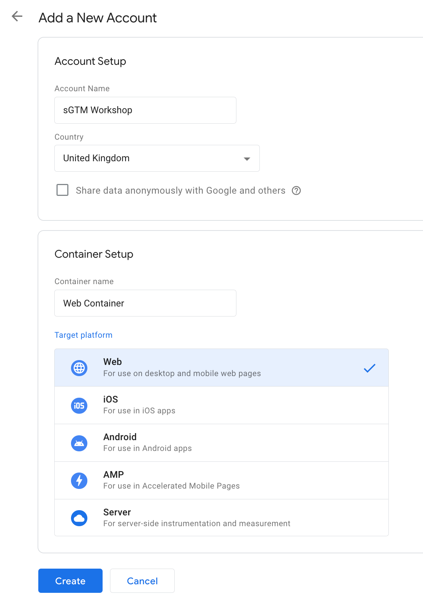
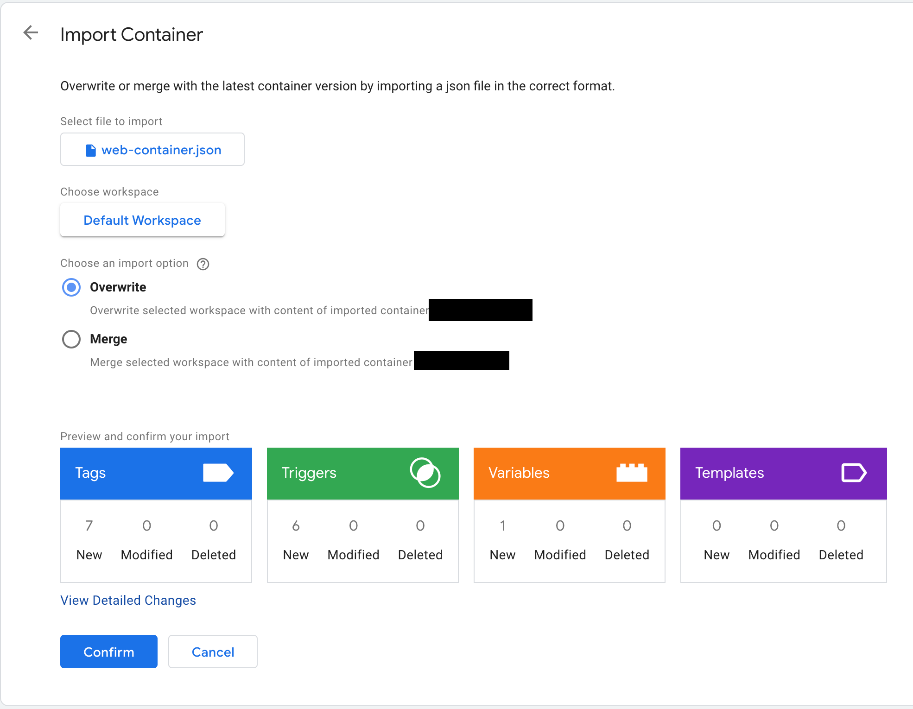

# Google Tag Manager Setup

This directory contains information about how to set up a Google Tag Manager
(GTM) web container to work with the demo e-commerce store.

## Instructions

### Google Analytics

1. Open [Google Analytics](http://analytics.google.com).
2. Create a new account with a GA4 property by selecting ⚙ Admin -> Create an
   account.
3. Create a new data stream for web -> Enter the website URL if known, otherwise
   this can be updated later.
4. Make a note of the measurement ID.

### Google Tag Manager

1. Open [Google Tag Manager](http://tagmanager.google.com).
2. Click "Create Account" and fill in the form, select "web" as the target
   platform for the container setup.
   
3. Open the web container -> Admin -> Import Container
   
4. Select the `web-container.json` file found under `src/` -> Choose default
   workspace, and overwrite and press confirm.
   
5. Go to Variables -> GA Measurement ID and enter the measurement ID from the
   Google Analytics setup above.
6. Press submit and publish the web container.

## Cheat Sheet

To deploy the Google Tag Manager server container

1. Open [Google Tag Manager](http://tagmanager.google.com).
2. Add a new server container to the account.
3. Automatically provision the server to have Google Tag Manager handle
   deploying the Docker image to App Engine.
4. Navigate to Admin -> Import Container
5. Select the `server-container.json` file found under `src/` -> Choose default
   workspace, overwrite and press confirm.
6. Go to Variables -> GA Measurement ID and enter the measurement ID from the
   Google Analytics setup above.
7. Press submit and publish the server container.
8. Open the web container -> Tags -> Open `[GA4 Configuration] All Pages` ->
   Edit -> Tick "Send to server container" and enter the URL of the server
   container.
   
9. Press submit and publish the web container.
