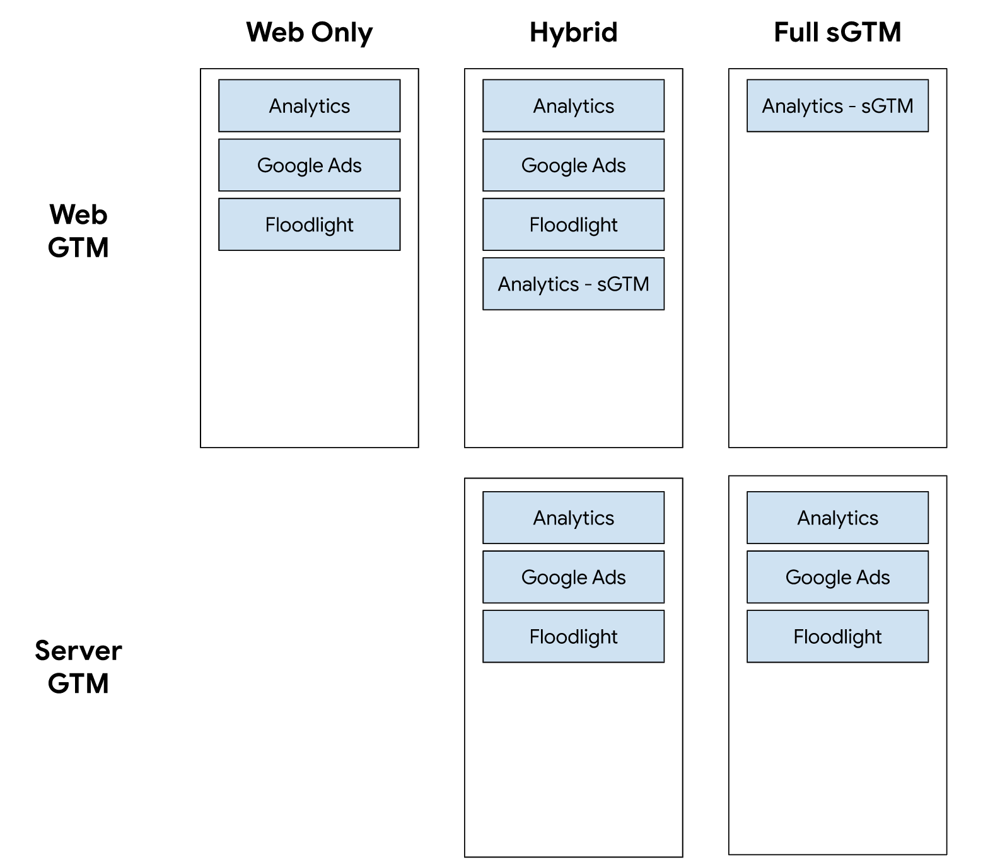

# Google Tag Manager Setup

This directory contains information about how to set up Google Tag Manager (GTM)
to work with the demo e-commerce store.

## Deployment Modes

There are 3 configurations that you can deploy this in:

-   Web Only: a web container in GTM controls all tagging.
-   Full sGTM: the web container routes events to the server container, and the
    server container handles all tagging.
-   Hybrid: is a combination of both. The web tagging remains in place, but it
    also sends events to the server. This allows you to dual report and ensure
    tagging is behaving as expected.

For hybrid mode there is dual conversion/event reporting:

## Instructions

### Google Analytics

1.  Open [Google Analytics](http://analytics.google.com).
2.  Create a new account with a GA4 property by selecting ⚙ Admin -> Create an
    account.
3.  Create a new data stream for web -> Enter the website URL if known,
    otherwise this can be updated later.
4.  Make a note of the measurement ID.

### Web Google Tag Manager

1.  Open [Google Tag Manager](http://tagmanager.google.com).
2.  Click "Create Account" and fill in the form, select "web" as the target
    platform for the container setup.
    
3.  Open the web container -> Admin -> Import Container
    

4.  Determine which configuration you would like to deploy:

    -   Web only: use [web-container.json](./src/web-container.json)
    -   Full sGTM: use
        [web-container-server-tags.json](./src/web-container-server-tags.json)
    -   Hybrid: use [web-container-hybrid.json](./src/web-container-hybrid.json)

5.  Select the file from the previous step -> Choose default workspace, and
    overwrite and press confirm.
    

6.  Go to Variables -> GA Measurement ID and enter the measurement ID from the
    Google Analytics setup above.

7.  Press submit and publish the web container.

### Server Side Google Tag Manager

If you want to run a web only configuration, you do not need to follow these
steps.

To deploy the Google Tag Manager server container:

1.  Open [Google Tag Manager](http://tagmanager.google.com).
2.  Add a new server container to the account.
3.  Automatically provision the server to have Google Tag Manager handle
    deploying the Docker image to App Engine.
4.  Navigate to Admin -> Import Container
5.  Select the [server-container.json](./src/server-container.json) file ->
    Choose default workspace, overwrite and press confirm.
6.  Press submit and publish the server container.
7.  Open the web container -> Tags -> Open `[GA4 Configuration] All Pages -
    sGTM` -> Edit -> and enter the URL of the server container.
    
8.  Press submit and publish the web container.
