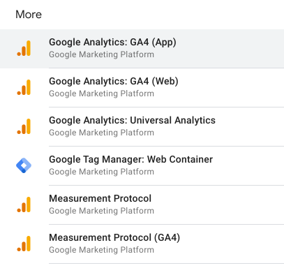
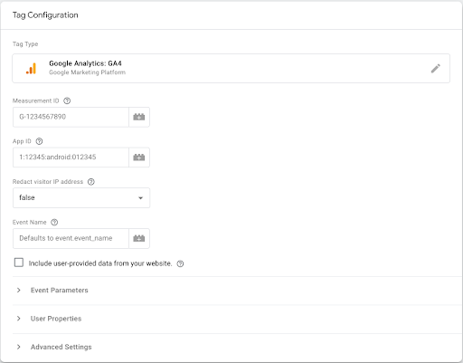
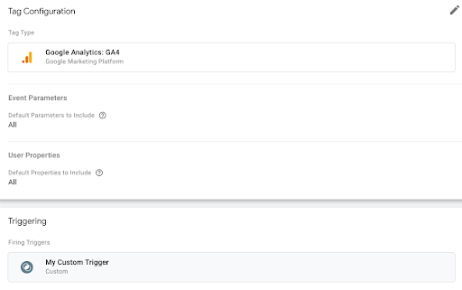
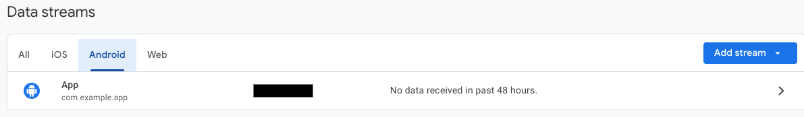
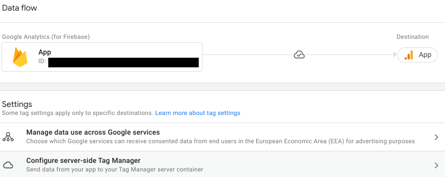
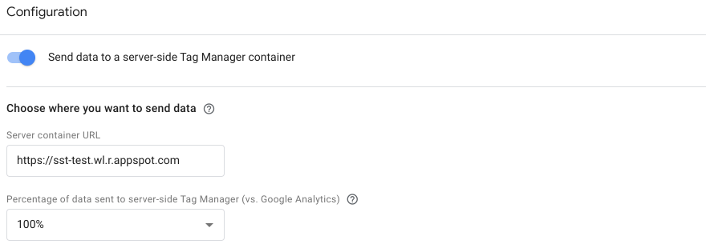
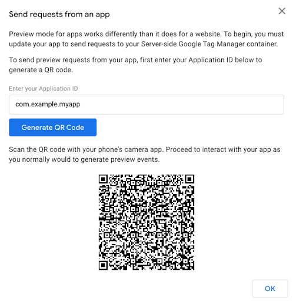

# Server-Side Tagging for Android Apps with Google Tag Manager

This document explains how to set up server-side tagging for your Android app using Google Tag Manager (GTM) and Firebase. This setup allows you to move tag firing from your app to a server, providing benefits like improved app performance, enhanced security, and greater control over your data.

## Overview

Server-side tagging with GTM involves sending data from your Android app to Google Analytics 4 (GA4) using the Firebase SDK. GA4 then forwards this data to your server-side GTM container, where you can manage and deploy marketing tags and tracking configurations.

## Setting up Server-Side Tagging for Your Android App

### 1. Prerequisites

* [An Android app](../app/README.md) with the Google Analytics for Firebase SDK installed and linked to a GA4 property.
* A Google Tag Manager account and a server container.
* A tagging server to host your server-side GTM container.

### 2. Enable Server-Side Tagging Uploads in Your App

Add the following to your application's `AndroidManifest.xml` to enable server-side tagging uploads:

```xml
<activity
    android:name="com.google.firebase.analytics.GoogleAnalyticsServerPreviewActivity"
    android:exported="true"
    android:noHistory="true">
    <intent-filter>
        <action android:name="android.intent.action.VIEW" />
        <category android:name="android.intent.category.DEFAULT" />
        <category android:name="android.intent.category.BROWSABLE" />
        <data android:scheme="tagmanager.sgtm.c.<APP_PACKAGE_ID>" />
    </intent-filter>
</activity>
<meta-data android:name="google_analytics_sgtm_upload_enabled" android:value="true" />
```

## 3. Configure Your Server Container

### Set Up the GA4 Client

1. In your server container, go to **Clients** and click **New**.
2. Click **Client Configuration**, then choose **Google Analytics: GA4 (App)**.
3. Enter a name for your client and click **Save**.



### Configure the GA4 Tag

1. In your server container, go to **Tags** and click **New**.
2. Click **Tag Configuration**, then choose **Google Analytics: GA4**.
3. The tag will automatically inherit the necessary data from the GA4 client.
4. Configure any desired event parameters, user properties, or advanced settings.



### Set Up Triggers

1. In the tag settings, click **Triggering**.
2. Click the **+** icon to create a new trigger.
3. Choose **Custom** or **Custom Event** as the trigger type.
4. Select **Some Events** and configure the trigger to fire on events with a **Client Name** that matches the name you gave your GA4 client.



## 4. Enable Server-Side Tagging in GA4

1. In your GA4 property, go to **Admin > Data Streams > Android** and select your app's data stream.

2. Click **Configure SDK settings > Configure server-side Tag Manager**.

3. Toggle **Send data to a server-side Tag Manager container**.

4. Enter your server container URL and choose the percentage of traffic to send to the server container.
5. Click **Save**.
   

## 5. Preview and Publish Your Container

1. In your server container, select **Preview** and follow the prompts to generate a QR code for previewing your setup in your app.
2. Once you've verified your configuration, publish your container to make the changes live.



## Known Limitations

*   To avoid potential security vulnerabilities, events from Android applications go through a stateless proxy server between the SDK and your server container. This proxy validates the request source and endpoint but doesn't inspect or store event data. The proxy is in the EU for EU-based traffic, consistent with how GA4 collects data from EU-based devices.
*   Automatically logged in-app purchases on Android rely on Google Play backend integration and aren't sent to the server container.
*   The `app_remove` event is not reported on Android.
*   Connecting your app data streams in Google Analytics to your Google Ads account is still necessary to import SDK data and conversions into Google Ads. Server-side tagging doesn't inherently integrate your SDK and Google Ads.
